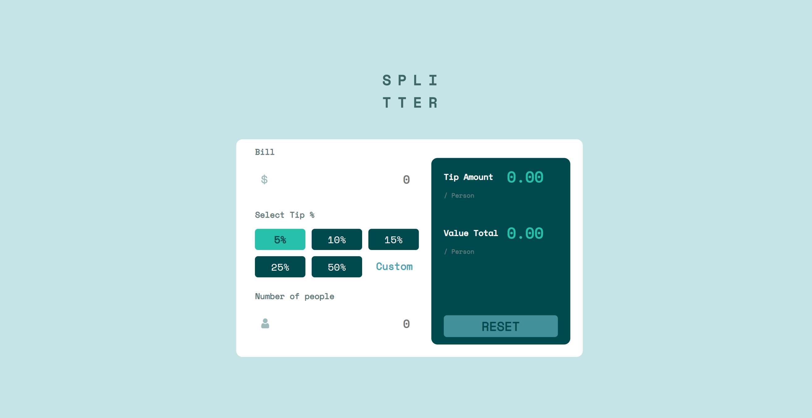
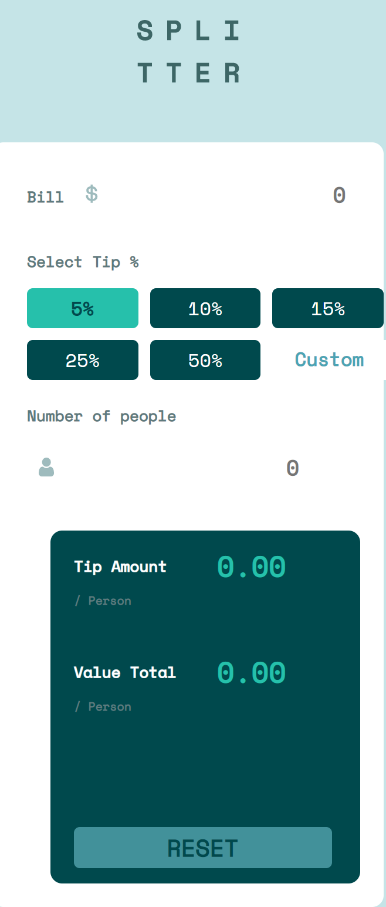

# Frontend Mentor - Tip calculator app solution

Essa é uma solução feita para o desafio do Front End mentor onde tem como objetivo aprimorar e colocar em prática os conhecimentos adquiridos em CSS, HTML e JS.

[Challenge](https://www.frontendmentor.io/challenges/tip-calculator-app-ugJNGbJUX).

## Sumário

- [Visão Geral](#overview)
  
  - [O desafio](#the-challenge)
  - [Screenshot](#screenshot)
  - [Links](#links)
  
- [Meu processo](#my-process)
  
  - [Feito com](#built-with)
  - [O que eu aprendi](#what-i-learned)
  - [Desenvolvimento Contínuo](#continued-development)
  - [Recursos Úteis](#useful-resources)
  
- [Autor](#author)

- [Aprendizagem](#acknowledgments)

  

## Visão Geral

### O desafio

Usuário deverão ser capaz de:

* Visualizar o layout independente do tamanho da tela de seus respectivos dispositivos;
* Visualizar os estados dos componentes interativos na página;
* Calcular o valor correto de gorjeta e o custo total já dividido por pessoa;

### Screenshot

Desktop Preview

Mobie Preview:

### Links

- Solution URL: [Here](https://github.com/Tokenph/Tip-Calculator)
- Live Site URL: [Here](https://tokenph.github.io/Tip-Calculator/)

## Meu processo

### Feito com

- HTML5 semântico;
- CSS3;
- CSS Grid;
- JavaScript Vanilla;

### O que eu aprendi:

A princípio eu tentei fazer através da técnica de mobile-first onde ficaria mais fácil de posicionar os elementos conforme a tela for crescendo e de início realmente ficou bem simples o processo e consegui fazer de forma bem rápida, no entanto, conforme foi chegando aos ultimos detalhes com o CSS acabei encontrando alguns problemas e tive que ir refatorando todo o HTML e, consequentemente, todo o CSS um pouco frustante mas consegui aprender com meus erros do início XD.

Quanto a aplicação do JavaScript foi até mais "simples" do que eu estava imaginando, apesar de ainda ter um problema que não consegui corrigir onde o usuário não consegue "deselecionar" a porcentagem da gorjeta, não encontrei uma forma que conseguisse corrigir isso e ao mesmo. Também tive que refatorar um pouco a função de início pelo bem do Clean Code já que uma única função estava fazendo várias "funções" dentro do código.

### Desenvolvimento Contínuo

Já no início eu consegui perceber o quão fácil um projeto pode ser tornar começando por mobile-first, os elementos são mais fáceis de serem posicionados e conforme a tela vai crescendo vai ficando bem mais simples de corrigir os posicionamentos do que no processo contrário onde seria necessário inúmeros media-queries, mas ainda acho que preciso continuar praticando já que não consegui utilizar 100% dessa forma.

Apesar de ter conseguido fazer as interatividades necessáris com o JS ainda sinto que preciso estudar mais e praticar muito mais pra finalmente se sentir seguro e partir pra um FrameWork.

## Autor

- Frontend Mentor - [@tokenph](https://www.frontendmentor.io/profile/Tokenph)
- Linkedin - [@yourusername](https://www.linkedin.com/in/mbarbosasan/)
